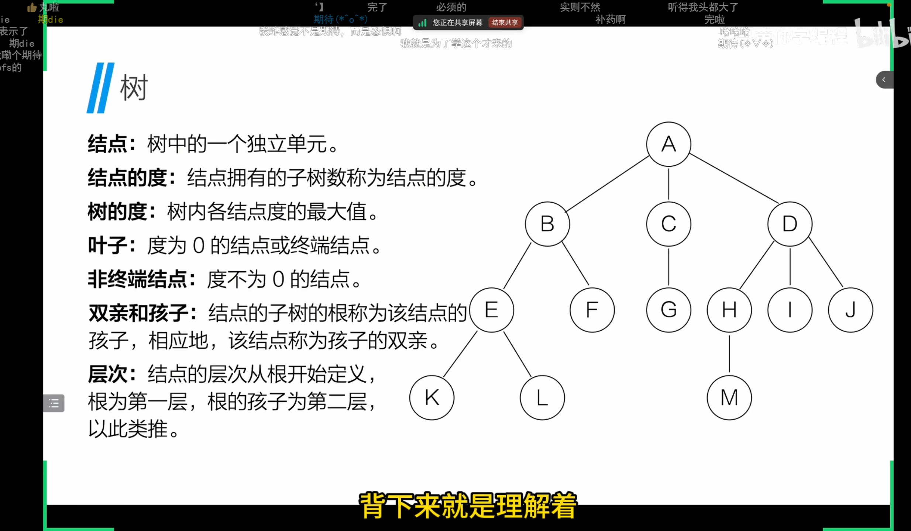
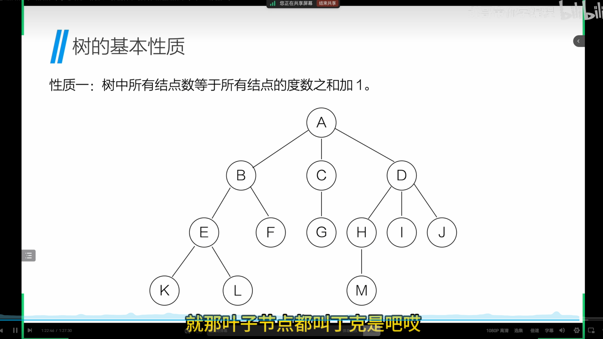
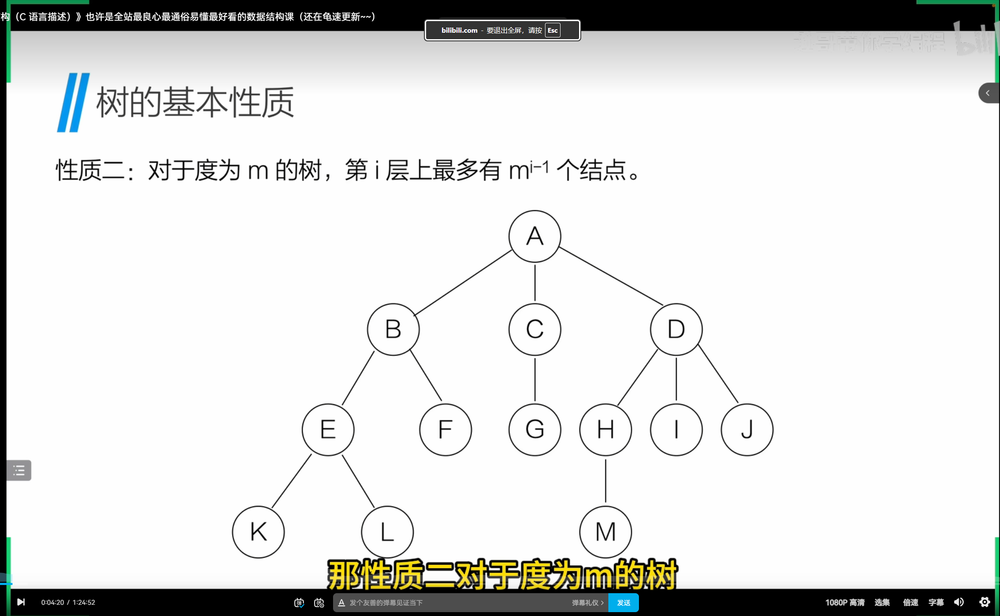
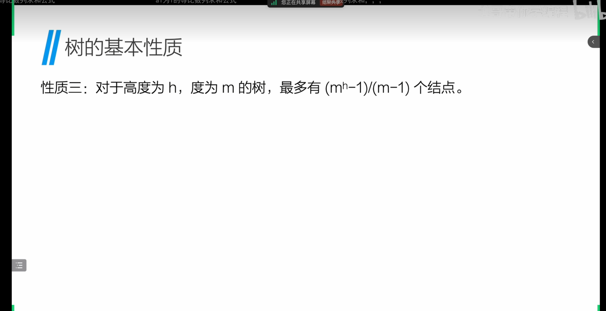
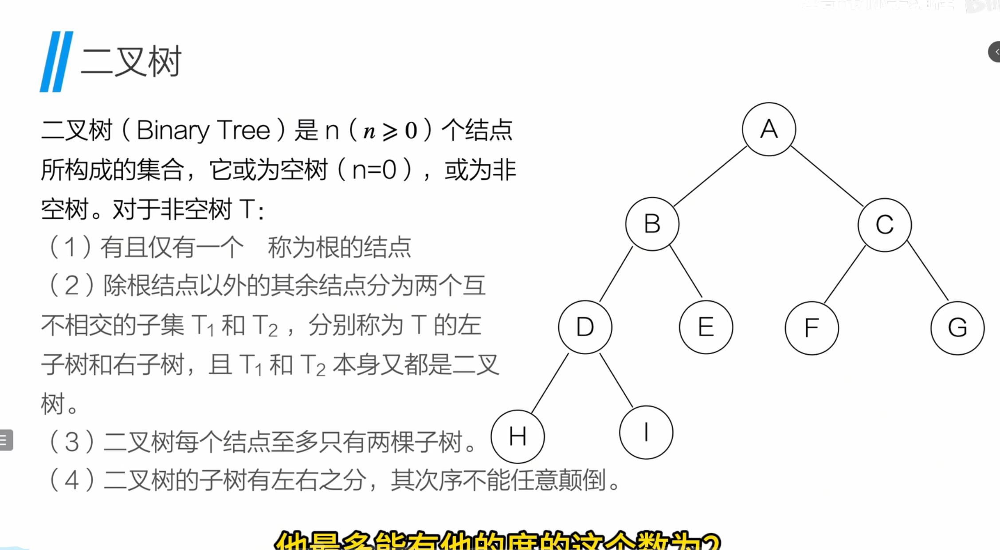
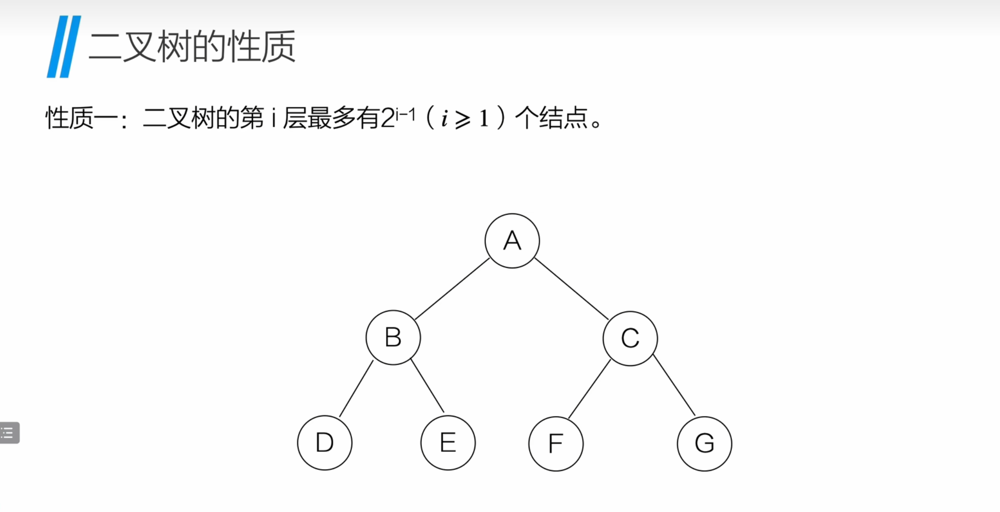
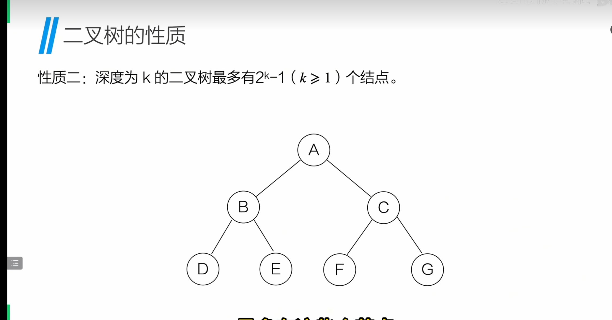
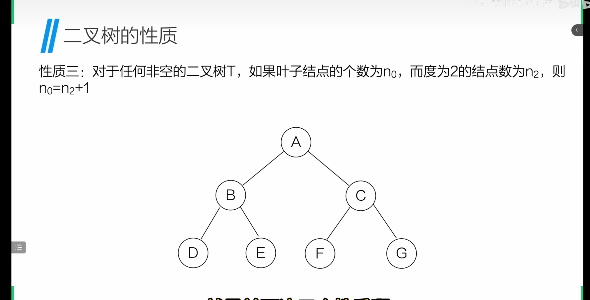
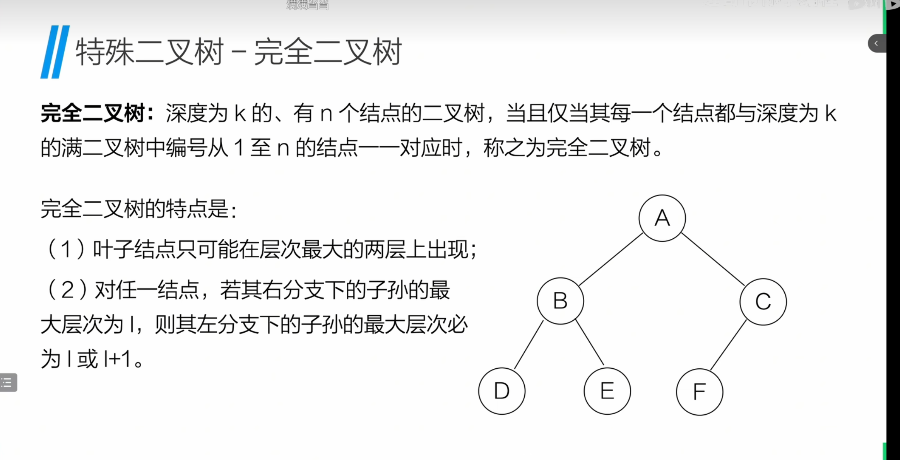
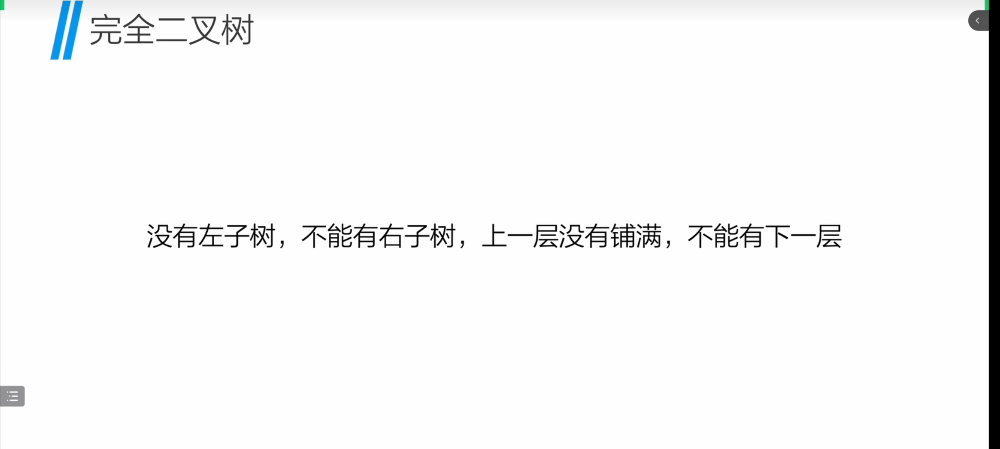

# 树

## 树的定义

## 树的性质

## 二叉树

### 二叉树的性质

### 特殊的二叉树

- *完全二叉树的记忆口诀*

### 例题

### 二叉树遍历性质

### 哈弗曼树

#### 如何构造哈夫曼树

- 
- 
- 
- 
- 

### 树和二叉树的转换

#### 树到二叉树

- 
- 

#### 二叉树到树

- 
- 

### 森林与二叉树的转换

